# AI Lead Management System Workflow

This document describes the comprehensive workflow for an AI-powered lead management system with conversational AI, automated follow-ups, and SDR handoff capabilities.

## Workflow Diagram

## Workflow Overview

This system consists of five main workflows that work together to create a comprehensive AI-powered lead management solution:

### Workflow 1: Lead Ingestion & State Management
- Handles new lead intake and initial data validation
- Creates lead records and determines next steps
- Routes leads to either immediate handoff or AI engagement

#### Detailed Implementation

```mermaid
graph TB
    A[Webhook<br/>📥 New Lead Trigger<br/>URL: /webhook/new-lead] --> B[Set<br/>📝 Extract Lead Variables<br/>contact_id, name, source, timestamp]
    
    B --> C[Airtable<br/>📊 Create Record<br/>Table: AI Lead Log<br/>Status: AI Working]
    
    C --> D[Code<br/>🔍 Data Validation Check<br/>Check: address, roof_type, power_kw, eso_terms]
    
    D --> E{IF<br/>❓ Is Data Complete?<br/>missingFields.length === 0}
    
    E -->|✅ Yes - All 4 fields present| F[HTTP Request<br/>🚀 Trigger Handoff<br/>POST /webhook/handoff]
    
    E -->|❌ No - Missing fields| G[HTTP Request<br/>🤖 Trigger AI Engagement<br/>POST /webhook/ai-engage]
    
    F --> H[End<br/>✅ Complete Lead]
    G --> I[End<br/>🔄 AI Engagement Started]

    %% Node Configuration Details
    A -.-> A1["⚙️ Webhook Settings:<br/>• Method: POST<br/>• Authentication: None<br/>• Path: /webhook/new-lead"]
    
    B -.-> B1["⚙️ Set Node Config:<br/>• contact_id: $json.contact_id<br/>• full_name: $json.full_name<br/>• source: $json.source<br/>• created_at: $json.created_at"]
    
    C -.-> C1["⚙️ Airtable Config:<br/>• Operation: Create<br/>• Table: AI Lead Log<br/>• GHL Contact ID: contact_id<br/>• Lead Name: full_name<br/>• AI Status: 'AI Working'<br/>• Follow-up Count: 0"]
    
    D -.-> D1["⚙️ Code Logic:<br/>const required = ['address', 'roof_type', 'power_kw', 'eso_terms']<br/>let missing = []<br/>required.forEach(field => {<br/>  if (!leadData[field]) missing.push(field)<br/>})<br/>return {isComplete: missing.length === 0}"]

    %% Styling
    classDef webhookNode fill:#e74c3c,stroke:#c0392b,stroke-width:3px,color:#fff
    classDef processNode fill:#3498db,stroke:#2980b9,stroke-width:2px,color:#fff
    classDef decisionNode fill:#f39c12,stroke:#e67e22,stroke-width:2px,color:#fff
    classDef actionNode fill:#27ae60,stroke:#229954,stroke-width:2px,color:#fff
    classDef endNode fill:#95a5a6,stroke:#7f8c8d,stroke-width:2px,color:#fff
    classDef configNode fill:#ecf0f1,stroke:#bdc3c7,stroke-width:1px,color:#2c3e50
    
    class A webhookNode
    class B,D processNode
    class E decisionNode
    class C,F,G actionNode
    class H,I endNode
    class A1,B1,C1,D1 configNode
```

### Workflow 2: Conversational AI Logic & Context
- Manages real-time conversations with leads
- Handles opt-out requests and data collection
- Determines conversation flow and next questions
- Triggers handoff when all required data is collected

#### Detailed Implementation

```mermaid
graph TB
    A[Webhook<br/>AI Engage or Inbound Reply<br/>Multiple trigger endpoints] --> B[Airtable<br/>Get Record<br/>Table: AI Lead Log<br/>Filter: GHL Contact ID]
    
    B --> C[Code<br/>Check STOP Command<br/>Detect opt-out requests]
    
    C --> D{IF<br/>Is STOP Command?<br/>User wants to opt out}
    
    D -->|Yes - Opt out user| E[Airtable<br/>Update Record<br/>AI Status: AI Opt-Out]
    
    E --> F[GoHighLevel<br/>Add Tag<br/>Tag: AI Opt-Out]
    
    F --> G[End<br/>Opt-Out Processed]
    
    D -->|No - Continue chat| H[Code<br/>Parse Reply and Determine Field<br/>Extract info from response]
    
    H --> I[Airtable<br/>Update Lead Data<br/>Update specific field]
    
    I --> J[GoHighLevel<br/>Update Custom Field<br/>Mirror field in GHL]
    
    J --> K[Code<br/>Determine Next Question<br/>Check missing fields]
    
    K --> L{IF<br/>All Data Collected?<br/>Check completion status}
    
    L -->|Yes - Complete| M[HTTP Request<br/>Trigger Handoff<br/>POST to handoff workflow]
    
    L -->|No - Need more info| N[OpenAI<br/>Generate AI Response<br/>Create next question]
    
    N --> O[GoHighLevel<br/>Send SMS<br/>Deliver AI response]
    
    O --> P[Airtable<br/>Update Conversation<br/>Save message and history]
    
    P --> Q[End<br/>Message Sent]
    M --> R[End<br/>Ready for Handoff]

    %% Configuration Details
    A -.-> A1["⚙️ Webhook Settings:<br/>• Multiple endpoints<br/>• Handles both new engagement<br/>  and inbound replies<br/>• Extracts message body"]
    
    H -.-> H1["⚙️ Parse Reply Logic:<br/>if (lastQuestion.includes('address'))<br/>  fieldToUpdate = 'Adresas'<br/>else if (lastQuestion.includes('roof'))<br/>  fieldToUpdate = 'Stogo tipas'<br/>else if (lastQuestion.includes('power'))<br/>  fieldToUpdate = 'Galingumas (kW)'<br/>else if (lastQuestion.includes('ESO'))<br/>  fieldToUpdate = 'ESO sąlygos'"]
    
    K -.-> K1["⚙️ Next Question Logic:<br/>const questions = {<br/>  'Adresas': 'Could you provide your address?',<br/>  'Stogo tipas': 'What type of roof do you have?',<br/>  'Galingumas (kW)': 'What power capacity in kW?',<br/>  'ESO sąlygos': 'Any grid connection requirements?'<br/>}"]
    
    N -.-> N1["⚙️ OpenAI Configuration:<br/>• Model: gpt-4<br/>• System: Friendly solar AI assistant<br/>• Context: Conversation history<br/>• Task: Ask next logical question<br/>• Temperature: 0.7"]

    %% Styling
    classDef webhookNode fill:#e74c3c,stroke:#c0392b,stroke-width:3px,color:#fff
    classDef processNode fill:#3498db,stroke:#2980b9,stroke-width:2px,color:#fff
    classDef decisionNode fill:#f39c12,stroke:#e67e22,stroke-width:2px,color:#fff
    classDef actionNode fill:#27ae60,stroke:#229954,stroke-width:2px,color:#fff
    classDef endNode fill:#95a5a6,stroke:#7f8c8d,stroke-width:2px,color:#fff
    classDef aiNode fill:#9b59b6,stroke:#8e44ad,stroke-width:2px,color:#fff
    classDef configNode fill:#ecf0f1,stroke:#bdc3c7,stroke-width:1px,color:#2c3e50
    
    class A webhookNode
    class C,H,K processNode
    class D,L decisionNode
    class B,E,F,I,J,O,P,M actionNode
    class N aiNode
    class G,Q,R endNode
    class A1,H1,K1,N1 configNode
```

### Workflow 3: Automated Follow-ups & Maintenance
- Runs hourly to check for leads needing follow-up
- Sends automated follow-up messages based on engagement level
- Marks leads as unresponsive after multiple attempts

#### Detailed Implementation

```mermaid
graph TB
    A[Schedule Trigger<br/>⏰ Hourly Follow-up Check<br/>Every hour, 8AM-9PM only] --> B[Airtable<br/>📊 List Records<br/>Filter: AI Status = 'AI Working']
    
    B --> C[Code<br/>🔍 Filter Follow-up Candidates<br/>Check last message timestamp]
    
    C --> D[Split In Batches<br/>📦 Process One by One<br/>Batch Size: 1]
    
    D --> E{Switch<br/>🔀 Follow-up Type<br/>Based on follow-up count & time}
    
    E -->|📅 First Follow-up<br/>24 hours, count = 0| F[OpenAI<br/>🤖 Generate First Follow-up<br/>Gentle reminder message]
    
    F --> G[GoHighLevel<br/>📱 Send Follow-up SMS<br/>First follow-up message]
    
    G --> H[Airtable<br/>📊 Update Follow-up Count<br/>Set to 1]
    
    H --> I[Airtable<br/>📊 Update Timestamp<br/>Last Message Sent At]
    
    I --> J[End<br/>📨 First Follow-up Sent]
    
    E -->|📅 Second Follow-up<br/>72 hours, count = 1| K[OpenAI<br/>🤖 Generate Second Follow-up<br/>Final attempt message]
    
    K --> L[GoHighLevel<br/>📱 Send Follow-up SMS<br/>Second follow-up message]
    
    L --> M[Airtable<br/>📊 Update Follow-up Count<br/>Set to 2]
    
    M --> N[Airtable<br/>📊 Update Timestamp<br/>Last Message Sent At]
    
    N --> O[End<br/>📨 Second Follow-up Sent]
    
    E -->|❌ Mark Unresponsive<br/>7 days, count >= 2| P[Airtable<br/>📊 Update Status<br/>AI Status: 'Unresponsive']
    
    P --> Q[GoHighLevel<br/>🏷️ Add Tag<br/>Tag: 'AI Unresponsive']
    
    Q --> R[GoHighLevel<br/>🏷️ Remove Tag<br/>Remove: 'AI Working']
    
    R --> S[End<br/>❌ Marked Unresponsive]

    %% Configuration Details
    A -.-> A1["⚙️ Schedule Settings:<br/>• Cron: 0 8-21 * * *<br/>• Timezone: Local<br/>• Only business hours<br/>• Hourly execution"]
    
    C -.-> C1["⚙️ Filter Logic:<br/>const now = new Date()<br/>records.forEach(record => {<br/>  const lastMsg = new Date(record['Last Message Sent At'])<br/>  const hours = (now - lastMsg) / (1000 * 60 * 60)<br/>  const count = record['Follow-up Count'] || 0<br/>  <br/>  if (count === 0 && hours >= 24) return 'first'<br/>  if (count === 1 && hours >= 72) return 'second'<br/>  if (count >= 2 && hours >= 168) return 'unresponsive'<br/>})"]
    
    F -.-> F1["⚙️ First Follow-up AI:<br/>• Tone: Gentle, helpful<br/>• Message: 'Hi! Just following up...'<br/>• Include: Original question<br/>• Context: Previous conversation"]
    
    K -.-> K1["⚙️ Second Follow-up AI:<br/>• Tone: Final attempt, value-focused<br/>• Message: 'Last chance to help...'<br/>• Include: Benefits of responding<br/>• Context: This is final attempt"]

    %% Styling
    classDef scheduleNode fill:#9b59b6,stroke:#8e44ad,stroke-width:3px,color:#fff
    classDef processNode fill:#3498db,stroke:#2980b9,stroke-width:2px,color:#fff
    classDef decisionNode fill:#f39c12,stroke:#e67e22,stroke-width:2px,color:#fff
    classDef actionNode fill:#27ae60,stroke:#229954,stroke-width:2px,color:#fff
    classDef endNode fill:#95a5a6,stroke:#7f8c8d,stroke-width:2px,color:#fff
    classDef aiNode fill:#e74c3c,stroke:#c0392b,stroke-width:2px,color:#fff
    classDef configNode fill:#ecf0f1,stroke:#bdc3c7,stroke-width:1px,color:#2c3e50
    
    class A scheduleNode
    class C processNode
    class D,E decisionNode
    class B,G,H,I,L,M,N,P,Q,R actionNode
    class F,K aiNode
    class J,O,S endNode
    class A1,C1,F1,K1 configNode
```

### Workflow 4: Process Completion & SDR Handoff
- Handles the transition from AI to human SDR
- Generates lead summaries and final confirmation messages
- Creates opportunities in the sales pipeline
- Sends notifications to the sales team

#### Detailed Implementation

```mermaid
graph TB
    A[Webhook<br/>📥 Handoff Trigger<br/>URL: /webhook/handoff<br/>When all 4 fields collected] --> B[Airtable<br/>📊 Get Complete Record<br/>Fetch all lead data & history]
    
    B --> C[Code<br/>📋 Generate Lead Summary<br/>Format all collected information]
    
    C --> D[OpenAI<br/>🤖 Generate Final Message<br/>Professional closing message]
    
    D --> E[GoHighLevel<br/>📱 Send Final SMS<br/>Confirmation & ask for questions]
    
    E --> F[Airtable<br/>📊 Update Status<br/>AI Status: 'AI Complete']
    
    F --> G[Airtable<br/>📊 Set Completion Time<br/>AI Completion Timestamp]
    
    G --> H[GoHighLevel<br/>🏷️ Add Complete Tag<br/>Tag: 'AI Complete']
    
    H --> I[GoHighLevel<br/>🏷️ Remove Working Tag<br/>Remove: 'AI Working']
    
    I --> J[GoHighLevel<br/>📝 Update Custom Fields<br/>Address, Roof Type, Power, ESO]
    
    J --> K[GoHighLevel<br/>🎯 Create Opportunity<br/>Pipeline: Sales<br/>Stage: First Stage]
    
    K --> L[Slack<br/>💬 Send Notification<br/>Alert SDR team of qualified lead]
    
    L --> M[Airtable<br/>📝 Update Notes<br/>Conversation summary]
    
    M --> N[End<br/>✅ Lead Handed to SDR]

    %% Configuration Details
    A -.-> A1["⚙️ Webhook Settings:<br/>• Triggered by Workflows 1 & 2<br/>• Receives complete lead data<br/>• JSON payload with all fields"]
    
    C -.-> C1["⚙️ Summary Generation:<br/>const summary = `<br/>📋 Lead Qualification Complete!<br/><br/>👤 Name: ${record['Lead Name']}<br/>🏠 Address: ${record['Adresas']}<br/>🏠 Roof Type: ${record['Stogo tipas']}<br/>⚡ Power: ${record['Galingumas (kW)']} kW<br/>🔌 ESO: ${record['ESO sąlygos']}<br/><br/>✅ Ready for SDR contact`"]
    
    D -.-> D1["⚙️ Final Message AI:<br/>• Tone: Professional, helpful<br/>• Content: 'Thank you for providing...'<br/>• Include: Summary of their info<br/>• Ask: 'Any final questions?'<br/>• Close: 'Team will contact soon'"]
    
    L -.-> L1["⚙️ Slack Notification:<br/>Channel: #sales-team<br/>Message: '🎯 New qualified lead ready:<br/>Name: {{Lead Name}}<br/>Address: {{Address}}<br/>Power: {{kW}} kW<br/>📞 Ready for contact!'<br/>Format: Rich formatting with emojis"]
    
    K -.-> K1["⚙️ Opportunity Creation:<br/>• Pipeline: 'Sales'<br/>• Stage: First stage<br/>• Name: Lead Name + Address<br/>• Value: Based on kW (optional)<br/>• Custom Fields: All 4 data points<br/>• Source: AI Qualified"]

    %% Styling
    classDef webhookNode fill:#e74c3c,stroke:#c0392b,stroke-width:3px,color:#fff
    classDef processNode fill:#3498db,stroke:#2980b9,stroke-width:2px,color:#fff
    classDef actionNode fill:#27ae60,stroke:#229954,stroke-width:2px,color:#fff
    classDef endNode fill:#95a5a6,stroke:#7f8c8d,stroke-width:2px,color:#fff
    classDef aiNode fill:#9b59b6,stroke:#8e44ad,stroke-width:2px,color:#fff
    classDef notificationNode fill:#f39c12,stroke:#e67e22,stroke-width:2px,color:#fff
    classDef configNode fill:#ecf0f1,stroke:#bdc3c7,stroke-width:1px,color:#2c3e50
    
    class A webhookNode
    class C processNode
    class B,E,F,G,H,I,J,K,M actionNode
    class D aiNode
    class L notificationNode
    class N endNode
    class A1,C1,D1,L1,K1 configNode
```

### Workflow 5: System Maintenance & SDR Overrides
- Handles SDR override scenarios when humans take control
- Performs daily system maintenance and cleanup
- Generates performance reports and fixes data inconsistencies

#### Detailed Implementation

## Key Features

- **Hybrid AI-Human Approach**: Seamless transition between AI and human interaction
- **Automated Follow-ups**: Intelligent follow-up system with multiple touchpoints
- **Data Synchronization**: Real-time sync between Airtable and GoHighLevel
- **Opt-out Management**: Respectful handling of opt-out requests
- **Performance Monitoring**: Daily reports and system health checks
- **Flexible Override System**: Allows human intervention when needed 
