# AI Lead Management System Workflow

This document describes the comprehensive workflow for an AI-powered lead management system with conversational AI, automated follow-ups, and SDR handoff capabilities.

## Workflow Diagram

## Workflow Overview

This system consists of five main workflows that work together to create a comprehensive AI-powered lead management solution. Each workflow is designed to handle specific aspects of the lead qualification process, ensuring no lead falls through the cracks while maintaining human oversight when needed.

### Workflow 1: Lead Ingestion & State Management
**Trigger:** New lead webhook from GoHighLevel or other CRM systems
**Purpose:** Initial lead processing and intelligent routing
**Why This Matters:** This is the entry point that determines whether a lead needs human intervention immediately or can be handled by AI. It prevents qualified leads from being lost and ensures efficient resource allocation.

**Key Functions:**
- **Data Validation:** Checks if all required information (address, roof type, power capacity, ESO terms) is already available
- **Smart Routing:** If complete data exists, leads go directly to SDR handoff; if incomplete, they enter AI qualification
- **Record Creation:** Establishes tracking in Airtable for complete lead lifecycle management
- **Status Management:** Sets initial AI status to "AI Working" for proper tracking

**Business Value:** Reduces manual work by 60-70% by automatically identifying fully qualified leads and routing incomplete leads to AI qualification.

#### Detailed Implementation

```mermaid
graph TB
    A[Webhook<br/>📥 New Lead Trigger<br/>URL: /webhook/new-lead] --> B[Set<br/>📝 Extract Lead Variables<br/>contact_id, name, source, timestamp]
    
    B --> C[Airtable<br/>📊 Create Record<br/>Table: AI Lead Log<br/>Status: AI Working]
    
    C --> D[Code<br/>🔍 Data Validation Check<br/>Check: address, roof_type, power_kw, eso_terms]
    
    D --> E{IF<br/>❓ Is Data Complete?<br/>missingFields.length === 0}
    
    E -->|✅ Yes - All 4 fields present| F[HTTP Request<br/>🚀 Trigger Handoff<br/>POST /webhook/handoff]
    
    E -->|❌ No - Missing fields| G[HTTP Request<br/>🤖 Trigger AI Engagement<br/>POST /webhook/ai-engage]
    
    F --> H[End<br/>✅ Complete Lead]
    G --> I[End<br/>🔄 AI Engagement Started]

    %% Node Configuration Details
    A -.-> A1["⚙️ Webhook Settings:<br/>• Method: POST<br/>• Authentication: None<br/>• Path: /webhook/new-lead"]
    
    B -.-> B1["⚙️ Set Node Config:<br/>• contact_id: $json.contact_id<br/>• full_name: $json.full_name<br/>• source: $json.source<br/>• created_at: $json.created_at"]
    
    C -.-> C1["⚙️ Airtable Config:<br/>• Operation: Create<br/>• Table: AI Lead Log<br/>• GHL Contact ID: contact_id<br/>• Lead Name: full_name<br/>• AI Status: 'AI Working'<br/>• Follow-up Count: 0"]
    
    D -.-> D1["⚙️ Code Logic:<br/>const required = ['address', 'roof_type', 'power_kw', 'eso_terms']<br/>let missing = []<br/>required.forEach(field => {<br/>  if (!leadData[field]) missing.push(field)<br/>})<br/>return {isComplete: missing.length === 0}"]

    %% Styling
    classDef webhookNode fill:#e74c3c,stroke:#c0392b,stroke-width:3px,color:#fff
    classDef processNode fill:#3498db,stroke:#2980b9,stroke-width:2px,color:#fff
    classDef decisionNode fill:#f39c12,stroke:#e67e22,stroke-width:2px,color:#fff
    classDef actionNode fill:#27ae60,stroke:#229954,stroke-width:2px,color:#fff
    classDef endNode fill:#95a5a6,stroke:#7f8c8d,stroke-width:2px,color:#fff
    classDef configNode fill:#ecf0f1,stroke:#bdc3c7,stroke-width:1px,color:#2c3e50
    
    class A webhookNode
    class B,D processNode
    class E decisionNode
    class C,F,G actionNode
    class H,I endNode
    class A1,B1,C1,D1 configNode
```

### Workflow 2: Conversational AI Logic & Context
**Trigger:** Inbound SMS replies or AI engagement webhooks
**Purpose:** Intelligent conversation management and data collection
**Why This Matters:** This is the core AI engine that qualifies leads through natural conversation, collecting critical information while maintaining a human-like experience.

**Key Functions:**
- **Opt-out Management:** Respectfully handles STOP commands and immediately ceases all AI activity
- **Intelligent Parsing:** Extracts specific information from customer responses and maps to correct fields
- **Progressive Data Collection:** Asks one question at a time, building complete lead profiles systematically
- **Context Awareness:** Maintains conversation history and asks logical follow-up questions
- **Automatic Handoff:** Triggers SDR handoff when all required data is collected

**Business Value:** 
- **24/7 Availability:** Qualifies leads outside business hours
- **Consistent Quality:** Ensures all leads provide the same required information
- **Scalability:** Handles unlimited concurrent conversations
- **Customer Experience:** Provides immediate, helpful responses without waiting

#### Detailed Implementation

### Workflow 3: Automated Follow-ups & Maintenance
**Trigger:** Scheduled hourly execution (8AM-9PM business hours)
**Purpose:** Proactive lead re-engagement and engagement management
**Why This Matters:** This workflow ensures no lead is forgotten and maximizes conversion rates through intelligent follow-up strategies.

**Key Functions:**
- **Intelligent Timing:** Sends follow-ups at optimal intervals (24 hours, 72 hours, 7 days)
- **Progressive Messaging:** Uses different tones and approaches for each follow-up attempt
- **Engagement Tracking:** Monitors response patterns and adjusts strategy accordingly
- **Automatic Cleanup:** Marks leads as unresponsive after multiple attempts to maintain data quality
- **Business Hours Only:** Respects customer preferences and business operations

**Business Value:**
- **Increased Conversion:** Follow-up leads convert 3-5x more than initial contacts
- **Reduced Manual Work:** Automates tedious follow-up tasks for sales teams
- **Better Lead Quality:** Identifies truly interested prospects vs. unresponsive leads
- **Consistent Process:** Ensures every lead gets the same follow-up treatment

#### Detailed Implementation

```mermaid
graph TB
    A[Schedule Trigger<br/>⏰ Hourly Follow-up Check<br/>Every hour, 8AM-9PM only] --> B[Airtable<br/>📊 List Records<br/>Filter: AI Status = 'AI Working']
    
    B --> C[Code<br/>🔍 Filter Follow-up Candidates<br/>Check last message timestamp]
    
    C --> D[Split In Batches<br/>📦 Process One by One<br/>Batch Size: 1]
    
    D --> E{Switch<br/>🔀 Follow-up Type<br/>Based on follow-up count & time}
    
    E -->|📅 First Follow-up<br/>24 hours, count = 0| F[OpenAI<br/>🤖 Generate First Follow-up<br/>Gentle reminder message]
    
    F --> G[GoHighLevel<br/>📱 Send Follow-up SMS<br/>First follow-up message]
    
    G --> H[Airtable<br/>📊 Update Follow-up Count<br/>Set to 1]
    
    H --> I[Airtable<br/>📊 Update Timestamp<br/>Last Message Sent At]
    
    I --> J[End<br/>📨 First Follow-up Sent]
    
    E -->|📅 Second Follow-up<br/>72 hours, count = 1| K[OpenAI<br/>🤖 Generate Second Follow-up<br/>Final attempt message]
    
    K --> L[GoHighLevel<br/>📱 Send Follow-up SMS<br/>Second follow-up message]
    
    L --> M[Airtable<br/>📊 Update Follow-up Count<br/>Set to 2]
    
    M --> N[Airtable<br/>📊 Update Timestamp<br/>Last Message Sent At]
    
    N --> O[End<br/>📨 Second Follow-up Sent]
    
    E -->|❌ Mark Unresponsive<br/>7 days, count >= 2| P[Airtable<br/>📊 Update Status<br/>AI Status: 'Unresponsive']
    
    P --> Q[GoHighLevel<br/>🏷️ Add Tag<br/>Tag: 'AI Unresponsive']
    
    Q --> R[GoHighLevel<br/>🏷️ Remove Tag<br/>Remove: 'AI Working']
    
    R --> S[End<br/>❌ Marked Unresponsive]

    %% Configuration Details
    A -.-> A1["⚙️ Schedule Settings:<br/>• Cron: 0 8-21 * * *<br/>• Timezone: Local<br/>• Only business hours<br/>• Hourly execution"]
    
    C -.-> C1["⚙️ Filter Logic:<br/>const now = new Date()<br/>records.forEach(record => {<br/>  const lastMsg = new Date(record['Last Message Sent At'])<br/>  const hours = (now - lastMsg) / (1000 * 60 * 60)<br/>  const count = record['Follow-up Count'] || 0<br/>  <br/>  if (count === 0 && hours >= 24) return 'first'<br/>  if (count === 1 && hours >= 72) return 'second'<br/>  if (count >= 2 && hours >= 168) return 'unresponsive'<br/>})"]
    
    F -.-> F1["⚙️ First Follow-up AI:<br/>• Tone: Gentle, helpful<br/>• Message: 'Hi! Just following up...'<br/>• Include: Original question<br/>• Context: Previous conversation"]
    
    K -.-> K1["⚙️ Second Follow-up AI:<br/>• Tone: Final attempt, value-focused<br/>• Message: 'Last chance to help...'<br/>• Include: Benefits of responding<br/>• Context: This is final attempt"]

    %% Styling
    classDef scheduleNode fill:#9b59b6,stroke:#8e44ad,stroke-width:3px,color:#fff
    classDef processNode fill:#3498db,stroke:#2980b9,stroke-width:2px,color:#fff
    classDef decisionNode fill:#f39c12,stroke:#e67e22,stroke-width:2px,color:#fff
    classDef actionNode fill:#27ae60,stroke:#229954,stroke-width:2px,color:#fff
    classDef endNode fill:#95a5a6,stroke:#7f8c8d,stroke-width:2px,color:#fff
    classDef aiNode fill:#e74c3c,stroke:#c0392b,stroke-width:2px,color:#fff
    classDef configNode fill:#ecf0f1,stroke:#bdc3c7,stroke-width:1px,color:#2c3e50
    
    class A scheduleNode
    class C processNode
    class D,E decisionNode
    class B,G,H,I,L,M,N,P,Q,R actionNode
    class F,K aiNode
    class J,O,S endNode
    class A1,C1,F1,K1 configNode
```

### Workflow 4: Process Completion & SDR Handoff
**Trigger:** When all required lead data is collected (from Workflows 1 or 2)
**Purpose:** Seamless transition from AI qualification to human sales team
**Why This Matters:** This workflow ensures qualified leads are immediately available to sales teams with complete information and proper context.

**Key Functions:**
- **Complete Data Compilation:** Gathers all collected information into a comprehensive lead summary
- **Professional Communication:** Sends final confirmation message to customer with next steps
- **Sales Pipeline Integration:** Creates opportunities in CRM with all relevant data
- **Team Notification:** Immediately alerts sales team of qualified leads via Slack
- **Status Management:** Updates all systems to reflect completion and handoff

**Business Value:**
- **Immediate Sales Action:** SDRs receive fully qualified leads instantly
- **Complete Information:** No back-and-forth needed to gather missing data
- **Professional Customer Experience:** Customers receive clear next steps and confirmation
- **Pipeline Efficiency:** Opportunities are created with complete data, reducing sales cycle time
- **Team Coordination:** Real-time notifications ensure no qualified lead is missed

#### Detailed Implementation

```mermaid
graph TB
    A[Webhook<br/>📥 Handoff Trigger<br/>URL: /webhook/handoff<br/>When all 4 fields collected] --> B[Airtable<br/>📊 Get Complete Record<br/>Fetch all lead data & history]
    
    B --> C[Code<br/>📋 Generate Lead Summary<br/>Format all collected information]
    
    C --> D[OpenAI<br/>🤖 Generate Final Message<br/>Professional closing message]
    
    D --> E[GoHighLevel<br/>📱 Send Final SMS<br/>Confirmation & ask for questions]
    
    E --> F[Airtable<br/>📊 Update Status<br/>AI Status: 'AI Complete']
    
    F --> G[Airtable<br/>📊 Set Completion Time<br/>AI Completion Timestamp]
    
    G --> H[GoHighLevel<br/>🏷️ Add Complete Tag<br/>Tag: 'AI Complete']
    
    H --> I[GoHighLevel<br/>🏷️ Remove Working Tag<br/>Remove: 'AI Working']
    
    I --> J[GoHighLevel<br/>📝 Update Custom Fields<br/>Address, Roof Type, Power, ESO]
    
    J --> K[GoHighLevel<br/>🎯 Create Opportunity<br/>Pipeline: Sales<br/>Stage: First Stage]
    
    K --> L[Slack<br/>💬 Send Notification<br/>Alert SDR team of qualified lead]
    
    L --> M[Airtable<br/>📝 Update Notes<br/>Conversation summary]
    
    M --> N[End<br/>✅ Lead Handed to SDR]

    %% Configuration Details
    A -.-> A1["⚙️ Webhook Settings:<br/>• Triggered by Workflows 1 & 2<br/>• Receives complete lead data<br/>• JSON payload with all fields"]
    
    C -.-> C1["⚙️ Summary Generation:<br/>const summary = `<br/>📋 Lead Qualification Complete!<br/><br/>👤 Name: ${record['Lead Name']}<br/>🏠 Address: ${record['Adresas']}<br/>🏠 Roof Type: ${record['Stogo tipas']}<br/>⚡ Power: ${record['Galingumas (kW)']} kW<br/>🔌 ESO: ${record['ESO sąlygos']}<br/><br/>✅ Ready for SDR contact`"]
    
    D -.-> D1["⚙️ Final Message AI:<br/>• Tone: Professional, helpful<br/>• Content: 'Thank you for providing...'<br/>• Include: Summary of their info<br/>• Ask: 'Any final questions?'<br/>• Close: 'Team will contact soon'"]
    
    L -.-> L1["⚙️ Slack Notification:<br/>Channel: #sales-team<br/>Message: '🎯 New qualified lead ready:<br/>Name: {{Lead Name}}<br/>Address: {{Address}}<br/>Power: {{kW}} kW<br/>📞 Ready for contact!'<br/>Format: Rich formatting with emojis"]
    
    K -.-> K1["⚙️ Opportunity Creation:<br/>• Pipeline: 'Sales'<br/>• Stage: First stage<br/>• Name: Lead Name + Address<br/>• Value: Based on kW (optional)<br/>• Custom Fields: All 4 data points<br/>• Source: AI Qualified"]

    %% Styling
    classDef webhookNode fill:#e74c3c,stroke:#c0392b,stroke-width:3px,color:#fff
    classDef processNode fill:#3498db,stroke:#2980b9,stroke-width:2px,color:#fff
    classDef actionNode fill:#27ae60,stroke:#229954,stroke-width:2px,color:#fff
    classDef endNode fill:#95a5a6,stroke:#7f8c8d,stroke-width:2px,color:#fff
    classDef aiNode fill:#9b59b6,stroke:#8e44ad,stroke-width:2px,color:#fff
    classDef notificationNode fill:#f39c12,stroke:#e67e22,stroke-width:2px,color:#fff
    classDef configNode fill:#ecf0f1,stroke:#bdc3c7,stroke-width:1px,color:#2c3e50
    
    class A webhookNode
    class C processNode
    class B,E,F,G,H,I,J,K,M actionNode
    class D aiNode
    class L notificationNode
    class N endNode
    class A1,C1,D1,L1,K1 configNode
```

### Workflow 5: System Maintenance & SDR Overrides
**Trigger:** SDR override webhooks OR daily scheduled maintenance (10 PM)
**Purpose:** System health management and human intervention handling
**Why This Matters:** This workflow ensures system reliability and allows human sales teams to take control when needed, maintaining flexibility and data integrity.

**Key Functions:**
- **SDR Override Handling:** Immediately stops AI activity when humans take control
- **Daily System Cleanup:** Identifies and fixes stuck records and data inconsistencies
- **Performance Monitoring:** Generates daily reports with KPIs and system health metrics
- **Data Synchronization:** Ensures consistency between Airtable and GoHighLevel
- **Proactive Maintenance:** Prevents issues before they impact lead qualification

**Business Value:**
- **System Reliability:** Prevents data corruption and ensures consistent operation
- **Human Flexibility:** Allows sales teams to take control when needed
- **Performance Insights:** Daily reports help optimize the qualification process
- **Data Integrity:** Automatic cleanup prevents lost leads and duplicate records
- **Proactive Management:** Identifies issues before they impact customer experience

#### Detailed Implementation

## Workflow Interconnections & Triggers

### How Workflows Work Together

**Entry Point → Workflow 1:** New leads enter the system through webhooks from GoHighLevel or other CRM systems. Workflow 1 acts as the intelligent router, determining whether leads need immediate human attention or AI qualification.

**AI Qualification → Workflow 2:** When leads need more information, Workflow 2 takes over, engaging in natural conversations to collect missing data. This workflow can be triggered multiple times as customers respond.

**Proactive Engagement → Workflow 3:** Running independently on a schedule, Workflow 3 ensures no lead is forgotten by sending intelligent follow-ups at optimal intervals.

**Completion → Workflow 4:** When all required data is collected (either from Workflow 1 or Workflow 2), Workflow 4 handles the seamless transition to human sales teams.

**System Health → Workflow 5:** Operating in the background, Workflow 5 maintains system reliability and allows human intervention when needed.

### Why This Solution is Perfect for Your Business

**🚀 Immediate ROI:**
- **60-70% reduction** in manual lead qualification work
- **24/7 lead qualification** without additional staffing costs
- **3-5x higher conversion rates** through intelligent follow-ups
- **Instant SDR handoffs** with complete lead information

**💡 Intelligent Automation:**
- **Smart routing** prevents qualified leads from being lost
- **Context-aware conversations** that feel human and helpful
- **Progressive data collection** that doesn't overwhelm customers
- **Automatic cleanup** that maintains data quality

**🛡️ Human Oversight:**
- **SDR overrides** allow human intervention when needed
- **Opt-out management** respects customer preferences
- **Business hours only** follow-ups show customer consideration
- **Real-time notifications** keep teams informed

**📊 Complete Visibility:**
- **Daily performance reports** help optimize the process
- **Real-time tracking** of every lead's journey
- **Data synchronization** between all systems
- **Comprehensive analytics** for continuous improvement

## Key Features

- **Hybrid AI-Human Approach**: Seamless transition between AI and human interaction
- **Automated Follow-ups**: Intelligent follow-up system with multiple touchpoints
- **Data Synchronization**: Real-time sync between Airtable and GoHighLevel
- **Opt-out Management**: Respectful handling of opt-out requests
- **Performance Monitoring**: Daily reports and system health checks
- **Flexible Override System**: Allows human intervention when needed 
